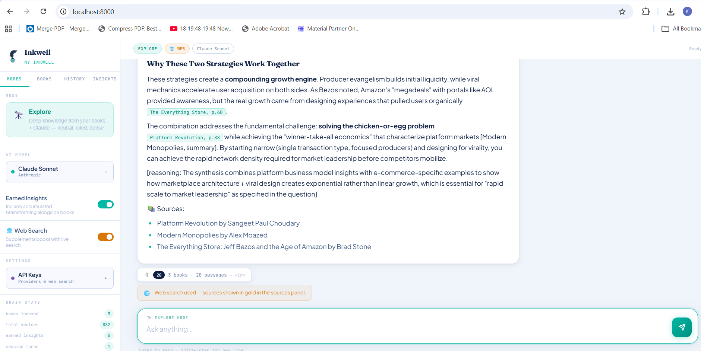
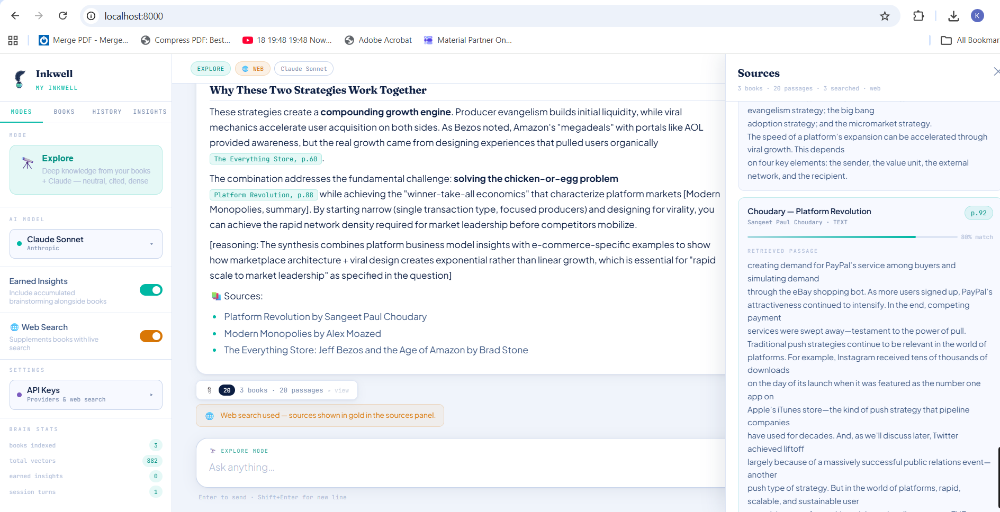
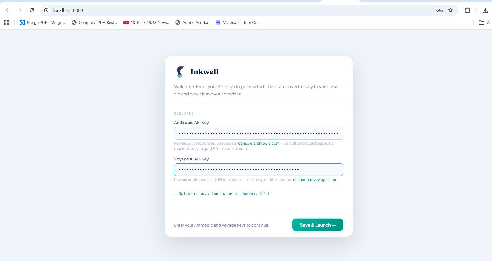
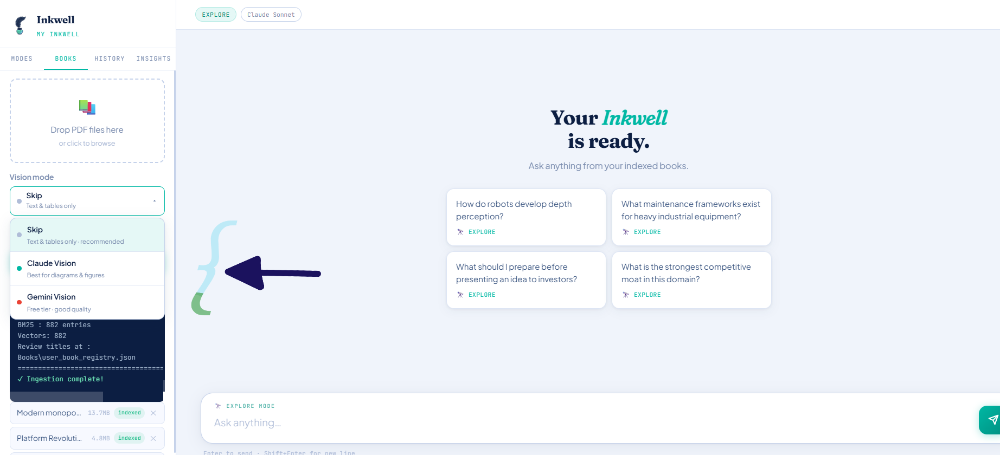

# Inkwell

Inkwell is a local, bring-your-own-key research assistant for PDF libraries. Add your books, index them on your machine, then ask questions and get answers with citations back to the exact pages and passages that informed them.

It is built for people who want to think with a curated library instead of asking the open internet first: founders, researchers, operators, students, writers, and domain experts with PDFs worth returning to.



## What You Can Do

- Ask questions across your own PDF library
- Get cited answers with page-level source references
- Open a citation drawer to inspect the actual retrieved passages
- Index text and tables by default, with optional vision modes for diagrams
- Save useful answers as Earned Insights and include them in future sessions
- Add optional Brave Search, OpenAI, Gemini, and DeepSeek keys
- Keep your books, keys, vectors, sessions, and notes local to your machine



## Current Status

Inkwell is an early local-first release. The core single-library workflow is usable today:

1. Install locally.
2. Add your own API keys.
3. Upload PDFs.
4. Ingest the books.
5. Ask questions.
6. Inspect citations.
7. Save useful insights.

Planned future updates include multiple project libraries, an easier update flow, stronger packaging, and broader Mac/Linux testing.

## Requirements

Required:

- Windows 10/11 for the tested installer flow
- Python 3.11+; the Windows installer can install it if missing
- Anthropic API key for answers
- Voyage AI API key for embeddings and book search

Optional:

- Brave Search API key for live web search
- Google API key for Gemini vision or Gemini synthesis
- OpenAI API key for GPT models
- DeepSeek API key for DeepSeek chat

Inkwell is BYOK software. You use your own provider accounts and control your own usage and billing. Provider free tiers and pricing can change, so check provider pricing pages before heavy use.

## Windows Setup

### 1. Download And Extract

Download the repository ZIP from GitHub, then choose **Extract All**.

Do not run `install.bat` from inside the compressed ZIP preview. If Windows shows a path under `Temp` or a `.zip` file, close it, extract the ZIP first, and run the installer from the extracted folder.

### 2. Run The Installer

Open the extracted `Inkwell-main` folder and double-click `install.bat`.

Windows may show this unsigned-file warning because Inkwell is not code-signed yet:


Click **Run** only if you downloaded Inkwell from the official GitHub repository:

```text
https://github.com/kartikey-vyas-DS/Inkwell
```

The installer will:

- Check for Python 3.11
- Create a virtual environment
- Install dependencies
- Create an Inkwell desktop shortcut


### 3. Add API Keys

Launch Inkwell from the desktop shortcut. Your browser will open to `http://localhost:8000`.

Enter your Anthropic and Voyage keys in the setup wizard. Optional provider keys can be added now or later from the **API Keys** button.



### 4. Add Books

Open the **Books** tab and upload your PDFs.

Vision mode options:

- **Skip**: text and tables only; recommended for most books
- **Claude Vision**: stronger for diagrams and technical figures
- **Gemini Vision**: useful if you prefer Google's vision model



### 5. Start Ingestion

Keep **Skip already-ingested books** enabled unless you intentionally want to re-process everything.

Click **Start Ingestion** and wait for the completion message. The progress bar and log show that the app is actively working.


### 6. Ask Questions

Once ingestion is complete, ask a question from the main chat screen. Good questions are specific and connected to your library, for example:

```text
What are the strongest practical ideas across these books?
```

Answers include inline citations. Click a citation to open the source drawer and inspect the passage behind the answer.

## Mac And Linux

Shell scripts are included:

```bash
chmod +x install.sh
./install.sh
./start.sh
```

The project is currently tested primarily on Windows. Mac/Linux support should improve over time, but expect some rough edges.

## Updating

For now, updates are manual.

If you cloned with git:

```bash
git pull
```

Then reinstall dependencies if `requirements.txt` changed.

If you downloaded a ZIP, download the new version and keep your local data safe:

- `.env`
- `Books/`
- `Inkwell Data/`

A safer in-app update flow is planned. The intended future model is: check GitHub for a newer version, pull changes for git installs, update dependencies, then ask the user to restart. Local data should remain outside git-tracked files.

## How It Works

1. Inkwell stores your API keys in a local `.env` file.
2. You upload PDF books through the browser UI.
3. The ingestion pipeline extracts text, tables, and optional figure descriptions.
4. Voyage creates embeddings.
5. ChromaDB stores searchable vectors locally in `Inkwell Data/`.
6. BM25 keyword search is combined with vector search.
7. The selected model writes an answer using retrieved context.
8. The UI shows citations and source passages.

Your `.env`, books, Chroma database, and session history are ignored by git and should stay on your machine.

## Project Structure

```text
app.py              FastAPI backend and API routes
query.py            Retrieval, reranking, model routing, and synthesis
ingest.py           PDF ingestion pipeline
config.py           Project configuration loader
storage.py          SQLite session and insight persistence
index.html          Browser UI
brain_config.json   Local project settings
.env.template       API key template
requirements.txt    Python dependencies
install.bat         Windows installer
install.sh          Mac/Linux installer
start.bat           Windows launcher
start.sh            Mac/Linux launcher
Books/              User PDFs go here
docs/assets/        README screenshots
```

## Configuration

`brain_config.json` controls the current library:

```json
{
  "project_name": "My Inkwell",
  "project_description": "My personal research and knowledge library",
  "project_goals": [],
  "vision_mode": "skip",
  "books_dir": "Books",
  "brain_dir": "Inkwell Data"
}
```

The browser setup wizard handles API keys. If you prefer manual setup, copy `.env.template` to `.env` and fill in the keys you want to use.

## Troubleshooting

**Windows says "Unknown Publisher"**

Inkwell is not code-signed yet, so Windows may warn before running `install.bat` or `start.bat`. Only click **Run** if you downloaded it from the official GitHub repository.

**The installer opens from a Temp or ZIP path**

You are probably running it from inside the ZIP preview. Extract the ZIP first, then run `install.bat` from the extracted folder.

**The browser opens before the server is ready**

Wait a few seconds and refresh `http://localhost:8000`.

**The setup wizard keeps appearing**

Make sure `ANTHROPIC_API_KEY` and `VOYAGE_API_KEY` are saved in `.env`, or enter them again in the setup wizard.

**Ingestion says no text was extracted**

The PDF is probably scanned or image-only. Run OCR first, then ingest again.

**Voyage rate limit during ingestion**

Wait and resume later, or check your Voyage account limits. Re-run ingestion with **Skip already-ingested books** enabled.

**Work or school laptop issues**

Managed devices may block Python installation, PowerShell, local servers, or database files. A personal machine is usually smoother.

## Tech Stack

- FastAPI and uvicorn
- Vanilla HTML/CSS/JavaScript
- ChromaDB
- Voyage embeddings
- BM25 keyword search
- Anthropic, OpenAI-compatible, Google Gemini, and DeepSeek model routing
- SQLite for local sessions and insights

## Acknowledgements

This project would not exist without the idea and inspiration of Mr. Yash Tiwari. I am grateful for his vision that made Inkwell possible.

## License

MIT
